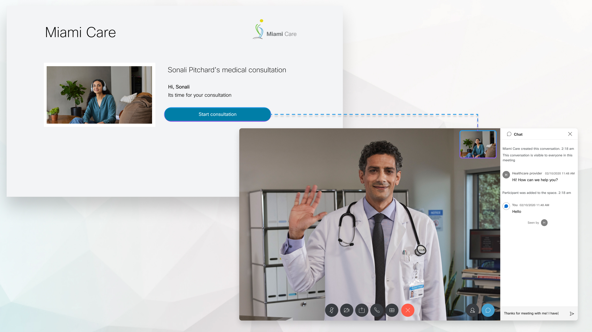

# Webex Instant Connect Overview

Webex Instant Connect empowers organizations across all verticals to enhance customer service, by facilitating video communications between end-users and experts. There is no need to download or install any application or plugin, customers and experts can connect directly through a web browser on desktop or mobile devices.

The Webex Instant Connect API provides the flexibility to schedule these sessions from external backends like Customer-Managed Relationship Systems (CRMs) and Electronic Medical Records (EMR) portals. Communication is highly secure, ensuring that and no private information is collected any point.

As a fully flexible platform, Webex Instant Connect can be utilized for B2C meetings in any industry. It also provides relevant functionalities in healthcare, including in-patient tele-consultation, hourly virtual rounding, family visitation, and others.

For more information, visit:

* [Webex Instant Connect](https://instant.webex.com)

* [Webex Instant Connect @ Webex Help Center](https://help.webex.com/en-us/article/sv0h2ab/Webex-Instant-Connect)

[Go to the Next section](./03-activation.md)

[Go to the Table of Contents](README.md#table-of-contents)
