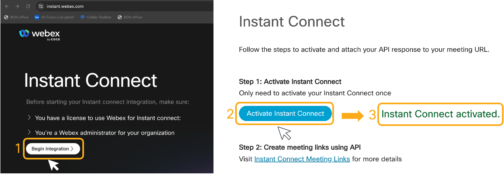
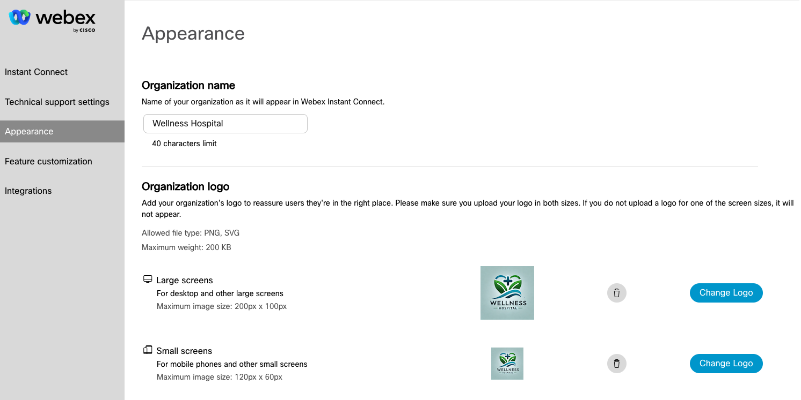

# Webex Instant Connect configuration

Log in https://instant.webex.com as a Webex administrator in your Webex ORG, and:

1. Click on **Begin Integration**

2. Click on **Activate Instant Connect**:

   

Now we are ready to learn how to use Webex Instant Connect API!

You can also configure Instant Connect appearance by adding your organization name and logo. For this healthcare example:

1. Go to **Appearance**, change the **Organization Name**. You can use, for example, 'Wellness Hospital'. 

2. Click on **Change Logo**, and use the pictures provided: [small](<images/hospital logo small.png>) and [big](<images/hospital logo big.png>).

[Go to the Next section](./04-instantconnectapi.md)

[Go to the Table of Contents](README.md#table-of-contents)