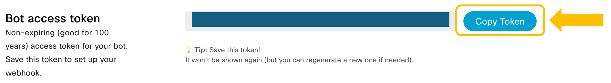
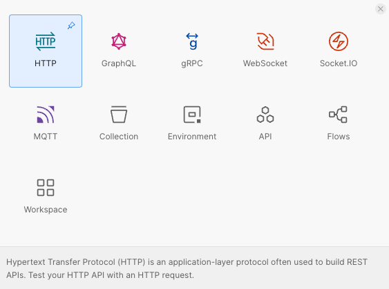
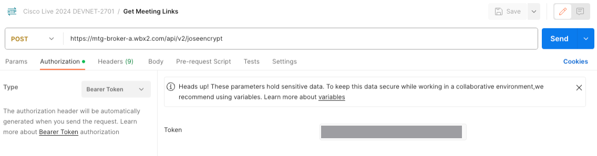

# Webex Instant Connect API

Now, let's build Instant Connect (IC) meeting links programmatically.

## Get an Access Token

You will need a Webex API access token to make calls to the IC API. You have two options:

* Your personal token for development purposes.

* A bot token for production use.

In this lab we will use a bot token.

## Create your BOT
1. Go to https://developer.webex.com/docs/bots and click on **Create a Bot**

2. Select your Bot name (for example 'Video Expert'), and an icon of your choice. 

3. Choose your bot username, this has to be unique. For example, you could do something 'lab-wx1-_yourusername_'

4. **App Hub Description**: we won't be publishing this bot to App Hub, but it is a good practice to add a meaningful description that will help you remember the purpose of the bot. For example, you can type something like '_This is the bot used for my wx1 lab 2857: 'Webex Connect with Instant Connect for video customer interactions_'

5. Click on **Add Bot** and **Copy your token!!** to a safe place, we will use later:




## Create a Postman Request to Get the Meetings List

This section will provide meeting links for host (expert) and guest (end customer) users.

1. Open Postman.

1. Select **New** and **HTTP**:

   

1. Rename your new Postman request to: `Get Meeting Links`

1. Choose **POST** as the request type, and enter the **UL** as: `https://mtg-broker-a.wbx2.com/api/v2/joseencrypt`

1. Select the **Auth** tab, and set **Type** as: `Bearer Token`.

   Enter the value of the bot token saved previously:

   

1. On the **Headers** tab, add a header:
   
   * Key: `Content-Type`
   * Value: `application/json`

1. Go to the **Body** for the request, select **raw** and **JSON** and enter this JSON object:

   ```js
   {
       "jwt": {
           "sub": "Instant Connect Meeting "
       },
       "aud": "a4d886b0-979f-4e2c-a958-3e8c14605e51",
       "provideShortUrls": true,
       "verticalType": "gen",
       "loginUrlForHost": false
   }
   ```

   Details/descriptions:

   * `sub` (Subject) string value can be whatever you like as long as it is unique for each meeting.

   * `aud` indicates the audience for which the jwt is intended. In this case it is Cisco, and the value is always the same.

   * `jwt` with `sub` and `aud` are mandatory parameters, the rest are optional.

   * `provideShortUrls`: Default: `false`. If set to `true`, the response will have shortened data portions of the meeting URL. It will also contain a shortened base URL, you will learn later how to use this data.

   * `verticalType`: Default: `hc`. Currently takes two values, `gen` for general flow, and `hc` for healthcare flow.

   * `loginUrlForHost`: Default `true`. Relevant only if `provideShortUrls` is true. If set to `false`, the short URL for hosts will be non-login links which means the host won't have an option to login for the meeting.

1. **Save** the request, and click on **Send**.

## Construct the Meeting URLs

You should have received a body like this in the API response:

```js
{
    "host": [
        {
            "cipher": "eyJwMnMiOiJpNmZta3dp...cWl3ZGw2cjFuSkg0bEUj",
            "short": "oCVp2LD"
        }
    ],
    "guest": [
        {
            "cipher": "eyJwMnMiOiJEQVdaHOBS...RDTvlZ-aLLRdIMSmCwEc",
            "short": "ckmNR7I"
        }
    ],
    "baseUrl": "https://instant.webex.com/visit/"
}
```
> **Note:** cipher values are truncated in the sample above.

Forming the meeting links is as simple as taking the `baseUrl` value and concatenating the values in `short`.

In this example, `https://instant.webex.com/visit/oCVp2LD` for the host and `https://instant.webex.com/visit/ckmNR7I` for the guest.

Now you only need to share the host URL with the expert providing support, and the guest URL with the end customer asking for support !!

This can be done by email, SMS, be integrated into some web portal, CRM, EMR, etc. In the next steps, you will learn how to do it in a digital channel like WhatsApp using Webex Connect.

[Go to the Next section](./05-backend.md)

[Go to the Table of Contents](README.md#table-of-contents)

