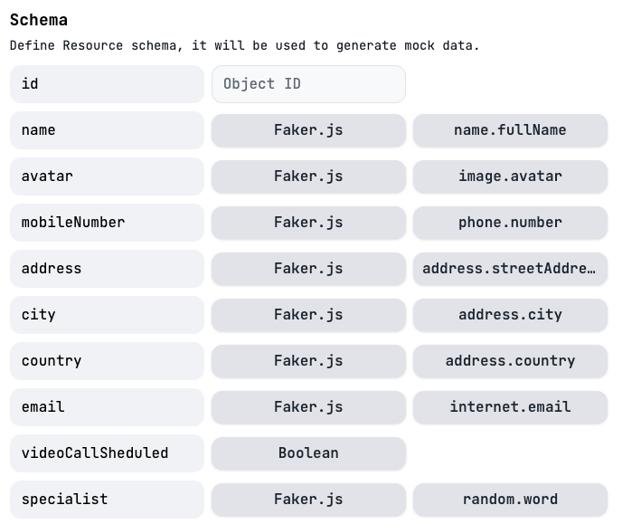

# Backend Preparation

One of the objectives of this lab is to demonstrate how Webex Connect can retrieve and update relevant business information from backend systems such as databases, CRMs or EMRs.

Let's set this up using mockAPI.io:

## Create a new Project

1. Open a browser and navigate to: https://mockapi.io

   Sign-in/sign-up as needed to log in.

2. Select **New Project**:

   

   and give it a name, for example: `My First Project`
   
   You can leave the **API Prefix** blank:

   !

## Create a New resource

1. Choose **New Resource**, and give it a name of your choice:

   

   (``ciscoliveEMEA2024`` is just an example)

2. Fill in the **Schema** section as shown below:
   

1. Click on **Create**.

## Populate database records

   You can ask mockAPI to create sample data automatically.

1. Select the gray bar under your resource and drag to indicate how many records you would like created.  Select something close to: `20`

   

2. Click on **Data**.

   You will see all the records that have been created. 
   
3. For this lab, you need to update the first record with the WhatsApp mobile number, we will use later, here's an example:

```js
   {
      "name": "Victor Vazquez",
      "avatar": "https://cloudflare-ipfs.com/ipfs/Qmd3W5DuhgHirLHGVixi6V76LhCkZUz6pnFt5AJBiyvHye/avatar/227.jpg",
      "mobileNumber": "34XXXXXXXXX",
      "address": "6002 Roob Lodge",
      "city": "Barcelona",
      "country": "Spain",
      "email": "Angie17@hotmail.com",
      "videoCallSheduled": true,
      "specialist": "Dr Julia Smith",
      "id": "1"
   }
```
   **IMPORTANT**: `mobileNumber` must include country code, and must **NOT** include '`+`'

4. Click on the small resource name link:

   

   This will open a browser tab and display the returned JSON data from your mock API resource.

   Note the URL, as this is the **Endpoint API** that you will use later in the lab.
   
   It should look something like:
   
   `https://xxxxxxxxxxxxxxxxxxxxxxxx.mockapi.io/ciscoliveEMEA2024`


[Go to the Next section](./06-connectflow-01.md)

[Go to the Table of Contents](README.md#table-of-contents)


