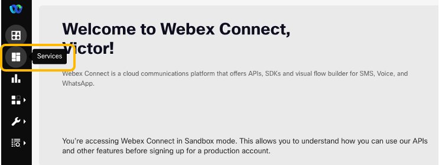
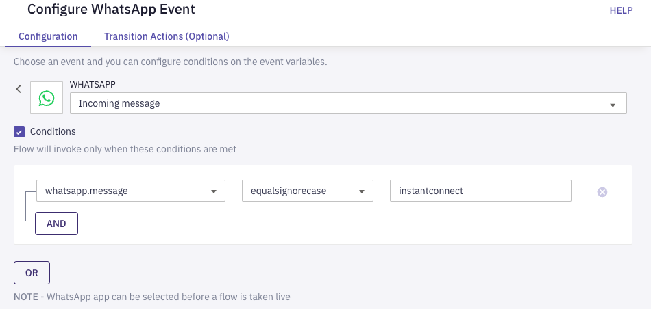
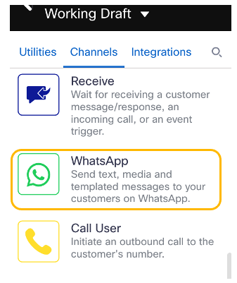

# Webex Connect Flow

The objective is to create a Webex Connect flow for a healthcare use case. We will do in sections.

**Table of Contents**

1. [Introduction](#introduction)
2. [Create a wew blank flow](#create-a-new-blank-flow)
3. [Flow trigger](#flow-trigger)
4. [Welcome message](./07-connectflow-02.md)
5. [Surgery Reminder](./08-connectflow-03.md)
6. [Video Meeting Scheduling](./09-connectflow-04.md)
7. [Create and share Instant Connect Meeting Links](./10-connectflow-05.md)
8. [Update CRM](./11-connectflow-06.md)

## Introduction

This is the interaction flow:

* Customer triggers the conversation on WhatsApp.
* Customer name is read from CRM.
* Surgery date is generated
* Surgery reminder is sent
* Video Consultation is scheduled with an specialist
* Video with instructions is sent to the customer
* Webex Instant Connect meeting links are created, and shared with the customer and the expert just before the meeting begins
* CRM is updated, indicating that the customer requested the video escalation, and the specialist chosen.
* Customer and expert join the meeting.

MOVE THIS PARAGRAPH TO A DIFFERENT SECTION OUTSIDE OF THE INTRO !!!

In a real project, normally there is a process or system in place to choose the best expert for a given customer or interaction. In this case, the expert is a static value.

## Create a new blank flow

1. Log in to Webex Connect, go to **Services**:

   

and choose some of your existing services, or create a new one. Then click on **Flows**, **Create Flow**

1. Give the flow a name, e.g.: `My first flow`

   - For **Method** select: `New Flow` and `Start from Scratch`

   - For **Trigger Category** select: `WhatsApp`

1. The **Event** should be `Incoming Message`.

1. Under **Conditions**, choose `whatsapp.message`, `equalsignorecase` and enter the key word that will trigger the flow, here: `instantconnect`. Rename this node to something like `Start` and click on **Save**.

   

   This will trigger the flow when the world `instantconnect`is sent to the system (no case sensitive).

## Flow trigger

Add a **WhatsApp** node to the canvas, and connect it to the **Configure WhatsApp Event** node (number 2). You should find the WhatsApp node in the Node Palette on the left of the screen:

   

   You can connect nodes in Webex Connect by dragging and dropping the green button from the first node to the second node.

   > **Note:** You can check the node number on the bottom-left corner of the node configuration screen, or by clicking the **Debug** button once you have a live version of the flow.

   
[Go to the Next section](./07-connectflow-02.md)
