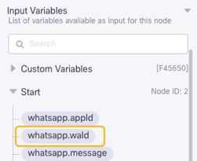
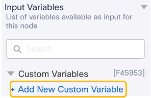
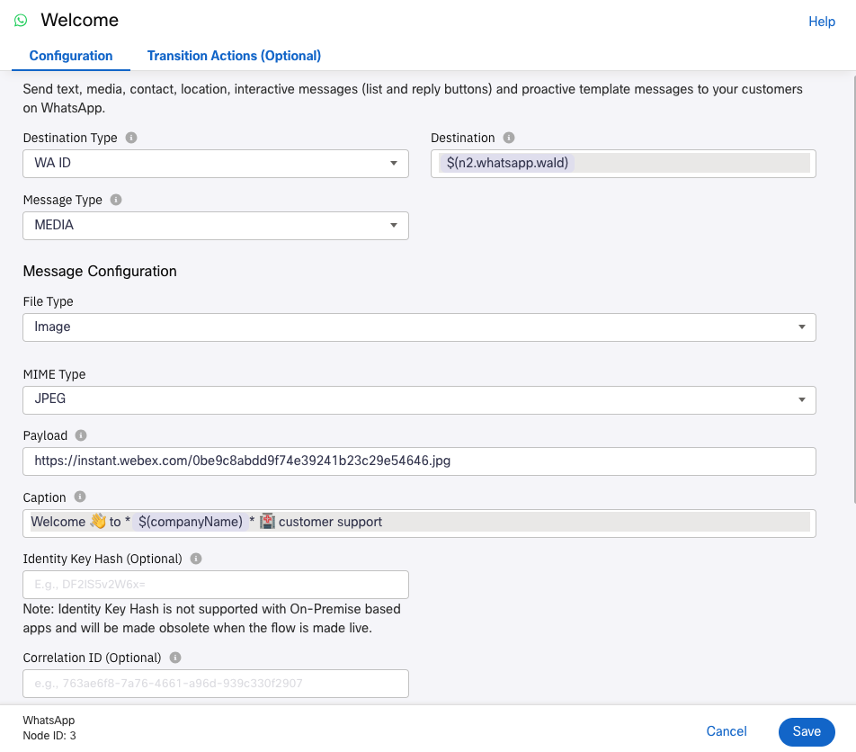

# Welcome message

WhatsApp is a rich channel supporting not only text but also images, videos and document sharing. Configure this new **WhatsApp** node to send a short Welcome message to the customer along with an image:

   - Destination Type = `WA ID`
   - Message Type = `MEDIA`
   - File Type = `IMAGE`
   - MIME TYPE = `JPEG`
   - Payload = `https://instant.webex.com/0be9c8abdd9f74e39241b23c29e54646.jpg`

   Now let's see how easy it is to work with variables in Webex Connect:
   As **Destination**, you need to have the customer mobile number. You can get it by clicking on **Start** and selecting ``whatsapp.waId`` at the upper right part of the screen:

   

   The value in the **Destination** field should be ``$(n2.whatsapp.waId)``. We are using one of the outputs of the first node (n2) as a variable in this new node.

   Now, let's start defining some Custom Variables. While the configuration screen for the WhatsApp node is still open, Click on **Custom Variables**, **Add New Custom Variable**:

   

   As **Variable Name**, type ``companyName``, and as **Default Value** ``Wellness Hospital``, and Save.

   Now, for the **Caption** field, type something like ``Welcome 👋 to *$(companyName)* 🏥 customer support``.
   
   Rename this node to something like `Welcome` and click on **Save**.

   

   You will be able to reference the Customer Name in any node in the flow using the variable ``$(companyName)``. WhatsApp (and the Webex Connect implementation of the WhatsApp) node supports emojis, and formatting text as bold (using *).

   **Save** your flow. It is a good practice to save it while you are building it.

[Go to the Next section](./08-connectflow-03.md)