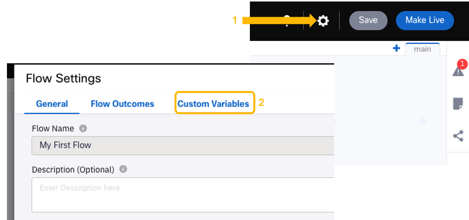
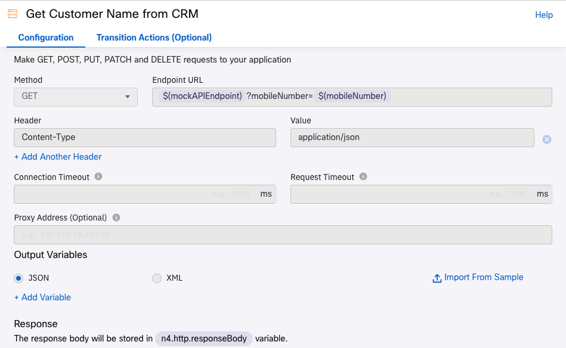
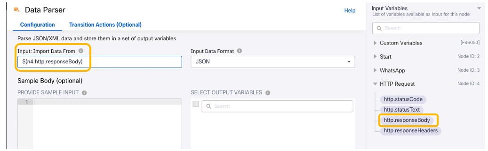
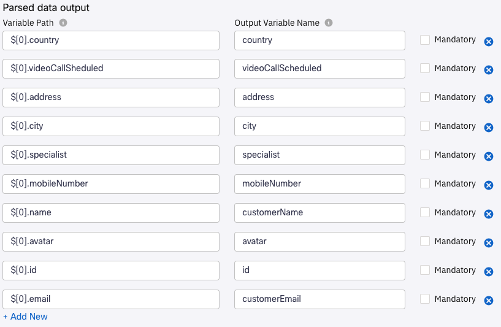
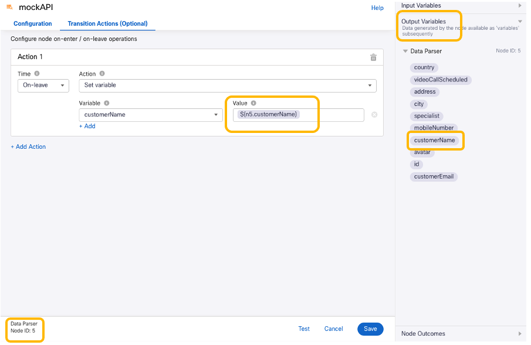
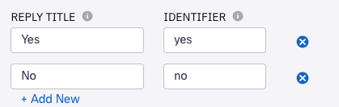
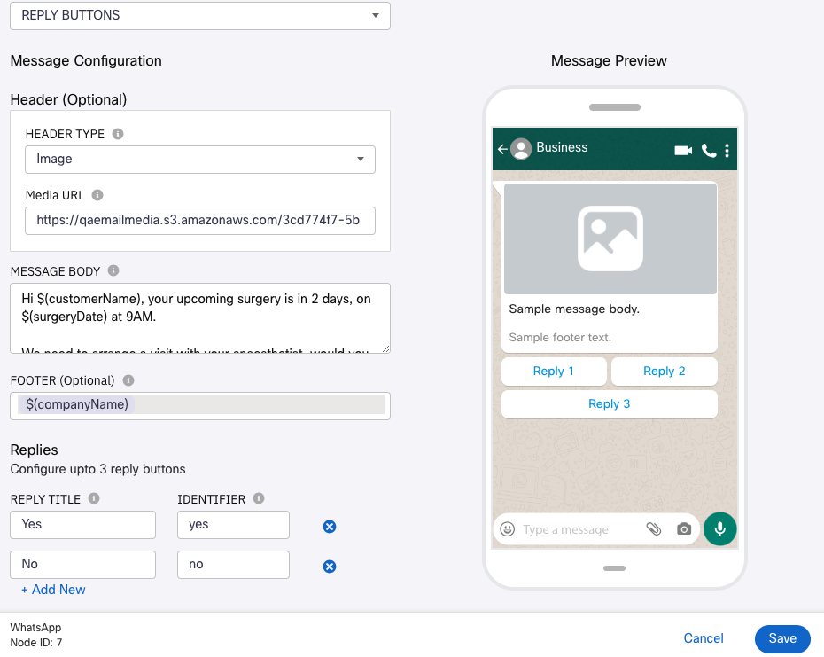

# Surgery reminder

## Get customer data

First, we will get the customer name from our backend mockAPI.

1. Click on the **Flow Settings** wheel, and choose **Custom Variables**

    

    Add a new variable, as **Variable Name**, type ``mockAPIEndpoint``, and as **Default Value** the **Endpoint API** noted in [this previous section](05-backend.md), and **Save**.
    
    (It should look like: ``https://xxxxxxxxxxxxxxxxxxxxxxxx.mockapi.io/ciscoliveEMEA2024``)

2. Add another Custom Variable:

    Variable Name = `mobileNumber`
    
    Default Value = your mobile phone number, with country code and without '+'. (for example 34XXXXXXXXX)

3. Add an **HTTP Request** node to the canvas, and connect it to the **WhatsApp node** configured previously. We will use this node to retrieve the customer name from the mock API.

    - For **Method** select: `GET`

   - For **Endpoint URL**, type: `$(mockAPIEndpoint)?mobileNumber=$(mobileNumber)`
   This is another example of the use of Variables inside Connect. You can access easily access them in the **Input Variables** section

   - For **Header**, use `Content-Type`, with value `application/json`

   - Rename this http request node to something like 'Get Customer Name from CRM' and **Save**.

    

4. Add a **Data Parser** node, and connect it to the **HTTP Request Node**. This will allow you to parse the data received from mockAPI, to be used later in any node in the flow.

   - For **Input: Import Data From**: under the **Input Variables** section to the right, select the `http.response.body` variable from the previous **HTTP Request** node 'Get Customer Name From' configured in the previous step:

    

    > **Note:** Node number may be different than shown above.

    - Now, we will populate **Sample Body (optional)** with some JSON that exemplifies the data we expect to be parsing.

        There are different ways to get such sample data. Usually, there are examples available on the documentation of the CRM/backend system you want to integrate with; or, you could perform the same `GET` request that the **HTTP Request** node executing in a tool like Postman, and then copy the response body.
   
        Here, we will use this sample JSON:
              
            [
                {
                    "name": "Victor Vazquez",
                    "avatar": "https://cloudflare-ipfs.com/ipfs/Qmd3W5DuhgHirLHGVixi6V76LhCkZUz6pnFt5AJBiyvHye/avatar/1039.jpg",
                    "mobileNumber": "34XXXXXXXXX",
                    "address": "6253 Gulgowski Canyon",
                    "city": "Barcelona",
                    "country": "Spain",
                    "email": "xxxxxx@cisco.com",
                    "videoCallScheduled": false,
                    "specialist": "Dr Julia Smith",
                    "id": "1"
                }
            ]
    
        (The actual key values - e.g. `Barcelona`, `id`, etc. - are not important, and could be anything or even empty.) 
        
        Copy/paste the JSON into the **Sample Body (optional) / PROVIDE SAMPLE INPUT** field, and click **PARSE**.
        
        Under **SELECT OUTPUT VARIABLES**, select all of the parsed variables, and choose **IMPORT**.

         The selected variables should be now in the **Parsed data output** section, under **OUTPUT VARIABLE NAME**.
        
    - Go ahead and give the variables names as shown below:

        

        
        Now all the fields in your customer record are available to be used in any node in the flow!

    - Rename the node to 'mockAPI', and click on **Save**.

5. Let's learn now about a very powerful Webex Connect feature: how to modify variables.

- Double-click on this very last 'mockAPI' **Data Parser** node that we created, and select **Transaction Actions (Optional)**

- Add a new action
- Under **Action 1**, select:
    Time = `On-leave`
    
    Action = `Set variable`
    
    Variable: add a new one selecting `+ ADD A NEW VARIABLE`. Use `customerName` as **Variable Name** , you do not need to give any Default Value.

    Once is the Variable is added, now you can give it as **Value** `$(n5.customerName)` :

    

    Note that the node numbers maybe different, and how you can access the output of this very same **Receive** node under **Output Variables**.

## Get Surgery Date

The surgery date could also be a CRM value. In this learning exercise, we will see how to work with dates inside Webex Connect, generating a date two days in the future programmatically.

1. Add an **Evaluate** node to the canvas, and connect it to the previous **Data Parser** node.

    The Evaluate node allows you to run JavaScript code as part of a flow execution.

    - Edit the Evaluate Node and paste these lines of code:

            function getDateIn48Hours() {
                let currentDate = new Date();
                currentDate.setTime(currentDate.getTime() + 48 * 60 * 60 * 1000);

                let day = ("0" + currentDate.getDate()).slice(-2);
                let month = ("0" + (currentDate.getMonth() + 1)).slice(-2);
                let year = currentDate.getFullYear();

                return day + "/" + month + "/" + year;
            }

            surgeryDate = getDateIn48Hours();
            1;

        This will generate a date two days in the future in the format `DD/MM/YYYY`
        
    - Create a Custom Variable with `surgeryDate` as **Variable Name**, you can leave the **Default Value** empty.

    - Set **Script Output** to `1`, and **Branch Name** to `success`
    
    - Rename this Evaluate Node to something like 'Get Surgery Date'

## Send Reminder

1. Add a **WhatsApp** node to the canvas and connect it to the previous **Evaluate** node. We will see in this section how you can use the WhatsApp Reply Buttons feature to enable rich and easy-to-use interactions with customers. Node settings:

   - Destination Type = `WA ID`
   - Destination = `$(n2.whatsapp.waId)`
   - Message Type = `REPLY BUTTONS`
   - Header Type = `Image`
   - Media URL = `https://qaemailmedia.s3.amazonaws.com/3cd774f7-5b9b-4098-a88c-0b0ed969c80b/hospitallogo_4360154910688899.jpeg`
   - MESSAGE BODY = `Hi $(customerName), your upcoming surgery is in 2 days, on $(surgeryDate) at 9AM. We need to arrange a visit with your anaesthetist, would you like to meet in video session?`
   - FOOTER = `$(companyName)`

   For the **Replies**, choose:

    

    Rename the node to something like 'Reminder', and save it.

    
