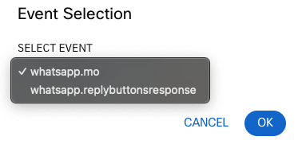

# Video Meeting Scheduling

## Working with for customer answers 

We will use the Receive Node to wait for a response from user. In this case it will listen both texts answers and buttons selection.

Add a **Receive** node to the canvas, and connect it to the previous **WhatsApp** node, and follow these steps to set it up:

1. Click on **Receive WhatsApp message**

2. For **Max Timeout** choose 120, and for **From WhatsApp ID** `$(n2.whatsapp.waId)`

3. Now we will configure the node to listen to text and button messages:
    Select `Reply Button Messages` on **Event Name** , click on **Add Another WhatsApp Event** and choose `Incoming Message`

4. Rename the node to `Receive - Text & Buttons' and **Save** it.

5. Add a **WhatsApp** node, connect it to the **Reply** button orange dot and configure it to send a text message to the customer:

    

    This node will send a message to teh customer if there is no answer received after the time out configured (120 seconds in this example)

## Conditional statements

Now we will evaluate the customer answer and take difference decisions based on it.

1. Add a **Branch** node to the canvas, and connect it ot the previous **Receive** node. When you click on the Branch node green button and drag to the branch node, you will get two options:

    

    You have to choose one first, repeat the action and choose the second. Both `whatsapp.mo` and `whatsapp.replybuttonsresponse` events have to be connected to the Branch node.

2. Configure the Branch node:

- Edit the branch 'Branch1', rename it to 'Yes'
- To choose the value in **Variable**, go to the **Input Variables** section at the right, click on the previous **Receive** node, **Whatsapp - Reply Buttons** and **whatsapp.replyButtonIdentifier**:

    

    Make **Condition** = `Equals` and **Value** = `yes`

- Click on **OR** and now choose  **Receive**, **Whatsapp - Incoming Message** , **whatsapp.message** or the value in **Variable**:

    

    Make **Condition** = `Equals ignore case` and **Value** = `yes`

- Rename the Branch node to something like 'Yes or No', and **Save**
    
    In this example we are not creating a branch for the 'No' option.

## Offer Scheduling options

1. Add a **WhatsApp** node to the canvas, and connect it ot the previous **Branch** node, choosing the 'Yes' event. Node settings:
    - Destination Type = `WA ID`
    - Destination = `$(n2.whatsapp.waId)`
    - Message Type = `LIST`
    - Header Text = `Video Consultation Scheduling`
    - MESSAGE BODY = `Thank you $(customerName), please choose one of these options 👇 for your video session:`
    - FOOTER TEXT = `$(companyName)`
    - LIST TITLE = `Available Dates`

    Click on **Configure List Items** and build this:

    

    Note that you could also user variables inside the **Description** fields to have dynamic texts in your WA lists!

    Rename the node to something like 'Appointment Scheduling - List' and **Save** it.

2. Add a **Receive** node to the canvas, and connect it ot the previous **WhatsApp** node. You can copy and paste the Receive Node you already created by selecting it and pressing CTRL+C + CTRL+V.

Then you only need to change the **Event Name** to `List Message`, rename the node to something like 'Receive - List' and **Save** it.

3. Connect the **Receive** node orange dot (Time Out output) to the 'Time out' **WhatsApp** node created previously.

4. Let's get now the customer selection for the specialist

- Double-click on this very last **Receive** node that we created, and select **Transaction Actions (Optional)**
- Add a new action
- Under **Action 1**, select:
    Time = `On-leave`
    Action = `Set variable`
    Variable: add a new one selecting `+ ADD A NEW VARIABLE`. Use `specialist` as **Variable Name** , you do not need to give any Default Value
    Once is the Variable is added, now you can give it as **Value** `$(n13.whatsapp.listRowTitle)`

    

    Note that the node numbers maybe different,  and how you can access the output of this very same **Receive** node under **Output Variables**.

5. Select the 'Time out' **WhatsApp** node we created before, copy-paste it onto the canvas and connect it to the previous **Receive** node.

- Now you only need to change the **Message** text to:

     `Thank you, your video appointment is confirmed, you will receive a message with the link to join just before before it begins`

- Rename it to 'Thanks and **Save** it

6. To illustrate one more WhatsApp integration in Connect rich feature, now we will share with the customer a video with instructions.

- Go to the 'Welcome' **WhatsApp** node we created at the beginning, select it, copy-paste it onto the canvas, and connect it with the previous **WhatsApp** node. Node settings:

    - File Type = `Video`
    - MIME Type = `MP4`
    - Payload = `https://qaemailmedia.s3.amazonaws.com/3cd774f7-5b9b-4098-a88c-0b0ed969c80b/143381-782178679_small_4382330926417677.mp4`
    - Caption = `Please, watch this video with instructions for staying overnight at $(companyName)`

    You can leave the rest of settings as they are

- Rename the node to 'Video with instructions' and **Save** it.

7. Now, to simulate that we are waiting for the Video appointment date, we will add a delay in the flow using the **Delay** node.

- Add a new **Delay** node to the canvas, and connect it with the previous **WhatsApp** node
- Edit it choosing `60` as the **Time Out (In Seconds) Delay Time** value

Now we are ready to create the meetings links and share them!

[Go to the Next section](./10-connectflow-10.md)
