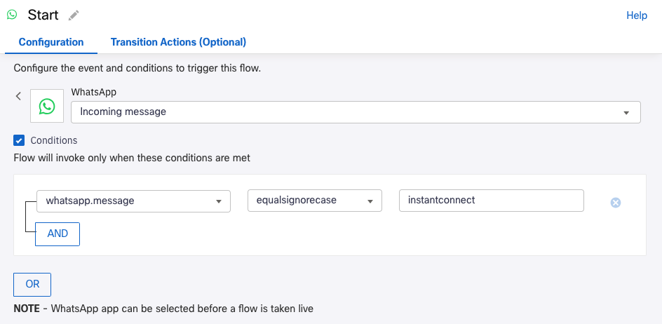

# Webex Connect Flow

## Introduction

The objective of this section is to create a Webex Connect flow that can be easily reused across various verticals.

This is the interaction flow:

* Customer triggers the conversation on WhatsApp.

* Customer name is read from CRM.

* At one point in the conversation, customer is offered with the possibility to have a video call with an expert (escalation to video).

* Webex Instant Connect meeting links are created, and shared with the customer and the expert.

* CRM is updated, indicating that the customer requested the video escalation.

* Customer and expert join the meeting.

In a real project, normally there is a process or system in place to choose the best expert for a given customer or interaction. With the intention of having a self-contained flow that can be used for demonstrations easily and quickly, the first nodes are typically designed to choose the expert.

## Create a New Blank Flow

1. Log in to Webex Connect, go to **Services / Flows** and click on **Create Flow**.

1. Give the flow a name, e.g.: `My first flow`

   * For **Type** select: `Work Flow`

   * For **Method** select: `New Flow` and `Start from Scratch`

   * For **Trigger Category** select: `WhatsApp`

1. The **Event** should be `Incoming Message`.

1. Under **Conditions**, enter the key word that will trigger the flow, here: `instantconnect`

   

1. Go to your Webex Connect **Sandbox Home** page.

   Click on the **WhatsApp Message** tab and select the **Receive WhatsApp Message** option.
   
   **Number to message** is your Connect sandbox WhatsApp number.

> **Note:** if this is your first time using Webex Connect, you may want to review some additional info:
> 1. [Hands-On Building Webex Connect Flows lab](https://devnetapps.cisco.com/learning/labs/webex-connect-flows/)
> 1. Cisco Live 2023 Devnet Session DEVNET-1850 recording, [Introducing Webex Connect and CPaaS APIs](https://www.ciscolive.com/on-demand/on-demand-library.html?search=DEVNET-1850#/session/1675722407287001tHws)


## Demonstration initialization

With the intention of having a self-contained Flow that can be used for demonstrations easily and quickly, you will use some nodes to get the customer email:

1. Add a **WhatsApp** node to the canvas, and connect it to the **Start** node (number 2).

   > **Note:** You can check the node number on the bottom-left corner of the node configuration screen, or by clicking the **Debug** button once you have a live version of the flow.

1. Configure this new **WhatsApp** node to send the following text message to the customer: 

   ```
   To initialize the demo, we need to know who will be the expert. Please, enter an expert email address 📧 '.
   ```

1. Rename the **WhatsApp** node to something like: `Get Agent Email`:

   

1. Add a **Receive** node, and connect it to the new **WhatsApp** node.

1. Configure the **Receive** node as below:

   * **MAX TIMEOUT**: `60`

   * **Receive WhatsApp message / EVENT NAME**: `Incoming messages`:

   

1. Let's create a custom variable for storing the expert's email address.

   Open the **Receive** node's **Transaction Actions (Optional)** tab.
   
   Under **Action1 / VARIABLE** click **+ADD** then **ADD NEW VARIABLE**.
   
   Enter the variable name: `expertEmail`:

   

   Since we are getting the expert email in this same **Receive Node**, the **Value** `$(n4.receive.message)` is taken from the **Output Variables** section at the right. 
   
   `n4` refers to the **Node Id**, `4` in this example.

1. Add a new **WhatsApp** node, and connect it to the **Receive** node's **onTimeout** outcome (orange dot).

   You can also copy/paste the previous **WhatsApp** node with **CTRL+C** and **CTRL+V**.
   
   If you do so, you can reuse some configuration settings.

1. Configure this new **WhatsApp** node to send the following text message to the customer:

   ```
   The demo timed out, thanks! 👋 
   ```

1. Rename this **WhatsApp** node to: `Time Out`:

   

When you finish this section, the flow should look something like this:


## CRM/Backend integration

1. Add an **HTTP Request** node to the canvas, and connect it to the **Receive node** configured previously.

1. We will use this node to retrieve the customer name from the mock API.

   Copy the **Endpoint URL** we noted in the previous step, and paste it into the **ENDPOINT URL** field, then append: `mobileNumber=$(n2.whatsapp.waId)`

   The complete URL should look something like:

   ```
   https://xxxxxxxxxxxxxxxxxxxxxxxx.mockapi.io/ciscolive2024EMEA?mobileNumber=$(n2.whatsapp.waId)
   ```

   

1. Rename the **HTTP Request** node to: `Get Customer Name from CRM`

1. Add a **Data Parser** node, and connect it to the **HTTP Request Node**.

   This will allow you to parse the data received from mockAPI, to be used later in any node in the flow.

1. Configure the **Data Parser** node.

   For **INPUT: IMPORT DATA FROM**: under the **Input Variables** section to the right, select the `http.response.body` variable from the previous **HTTP Request** node `Get Customer Name From` configured in the previous step:

   

   > **Note:** Node number may be different than shown above.

1. Next we will populate **Sample Body (optional)** with some JSON the exemplifies the data we expect to be parsing.

   There are different ways to get such sample data. Usually, there are examples available on the documentation of the CRM/backend system you want to integrate with; or, you could perform the same `GET` request that the **HTTP Request** node executing in a tool like Postman, then copy the response body.
   
   Here we will just use this sample JSON:

   ```json
   [
    {
        "name": "Victor Vazquez",
        "avatar": "https://cloudflare-ipfs.com/ipfs/Qmd3W5DuhgHirLHGVixi6V76LhCkZUz6pnFt5AJBiyvHye/avatar/1039.jpg",
        "mobileNumber": "123456789",
        "address": "6253 Gulgowski Canyon",
        "city": "Barcelona",
        "country": "Spain",
        "email": "vvazquez@cisco.com",
        "videoCallScheduled": false,
        "id": "1"
    }
   ]
   ```

   (The actual key values - e.g. `Barcelona`, `Spain`, etc. - are not important, and could be anything or even empty.) 
   
   Copy/paste the JSON into the **Sample Body (optional) / PROVIDE SAMPLE INPUT** field, and click **PARSE**.

1. Under **SELECT OUTPUT VARIABLES**, select all of the parsed variables, and choose **IMPORT**.

   The selected variables should be now in the **Parsed data output** section, under **OUTPUT VARIABLE NAME**.
   
1. Go ahead and give the variables names as shown below:

   
   
Now all the fields in your customer record are available to be used in any node in the flow!

When you finish this section, the flow should look something like:


It is also possible to update the CRM/backend from Webex Connect.  Let's do that in following section so you can build the flow in order.
  
## Instant Connect Integration

Now that you know who the expert is and the customer name, let's start by sending a "welcome" message to the customer:

1. Add a new **WhatsApp** node (or copy/paste one of the existing ones) and connect it to the **Data Parser** node.

1. Configure this new **WhatsApp** node to send the following message:

   ```
   🌍 Hi $(n7.customerName), welcome to our support center 🌍. How can we help you? If you want to have a 🎥 video call 🎥 with one of our experts, please say VIDEO
   ```

   `n7` refers to node number `7`, which should be the **Data Parser** node created previously.
   
1. Rename the **WhatsApp** node to: `Demo Starts`

1. Add a **Receive** node, and connect the green dot to the new **WhatsApp** node, and the orange dot to the `Time Out` **WhatsApp** node created previously.

1. Configure the **Receive** node:

   * **MAX TIMEOUT**: `60`
   * **Receive WhatsApp Messages**
   * Listen to **Incoming messages**.
   
   Again, use `$(n2.whatsapp.appId)` as the WhatsApp ID.

1. Add a **Branch** node and connect it to the **Receive** node via the green dot.

   (Note, later this might be a good place to add some addition functionality to the flow to cover some specific business logic, for example a Webex Connect bot; but for now we will use a simple example that can be used as an always-ready demonstration.)

   Create a branch called: `Video`, configured as below:

   
   
1. Add a new **WhatsApp** node and connect it to the **None of the above** branch node output.

   You will see this option by dragging and dropping the green dot.

1. Configure this new **WhatsApp** node to send the following message:

   ```
   Sorry, this option is not available in this demo
   ```
   
1. Rename the **WhatsApp** node to: `Answer not valid`

   Connect it back to the **WhatsApp** node `Demo Starts`.

## Main Flow Branch

Now you are ready to go on with the main flow branch in the following steps:

1. In the top-right corner of the screen, click the "gear"/settings icon and add a **Custom Variable**.

   Paste the value of the bot token previously generated in the [Webex Instant Connect API](04-instantconnectapi.md) step earlier.

   

1. Back in the flow canvas, add a new **HTTP Request** node, and connect it to the `Video` output of the **Branch** node.

   Since it is the only option left, you should see this option by default when you drag-and-drop the **Branch** node's green dot.

1. Similarly to what we did previously in the [Webex Instant Connect API](04-instantconnectapi.md) step earlier, here we will create Webex Instant Connect meeting links.  However, instead of using Postman we will use this **HTTP Request** node. Rename the node to 'Create meeting links'.

   Configure the **HTTP Request** node as shown below:

   

1. Add a **Data Parser** node, and connect it to the **HTTP Request** node.

1. Configure this node the same as the `Get Customer Name from CRM` **HTTP Request** node.

   For the **Sample Body**, use the response body you got in Postman, or the example provided.
   
   In this case you do not need to **Select** and **IMPORT** all the variables, `$.baseUrl`, `$.host[0].short` and `$.guest[0].short` are enough.
   
   Set the **OUTPUT VARIABLE NAMES** as shown below:

   

1. Next we will build variables containing the host and guest URLs.  We can use the embedded capabilities of Webex Connect nodes for this.

   Edit the last **Data Parse** node we created, and go to the **Transition Actions (Optional)** tab.
   
   Create two **Custom Variables**: `guestURL` and `hostURL`

   As we saw previously, the URL values are created by concatenating the base URL and the values in the `short` variable.  These are available under the **Output Variables** section:

   

   > **Note:** Node numbers may be different.

1. Add a new **WhatsApp** node, and connect it to the **Data Parse** node.

1. Configure this new **WhatsApp** node to send the following message:

    ```
    Click on the link 🔗 below 👇 to connect with your expert: $(guestURL)
    ```

1. Rename the **WhatsApp** node to: `Offer guest URL to customer`

When you finish this section, this is how your flow should look like:


## Webex Messaging Integration

Next we will use the [Webex messaging API](https://developer.webex.com/docs/api/v1/messages/create-a-message) to send a message from your Webex bot to the expert:

1. Add an **HTTP Request** node, and connect it to the **WhatsApp node** `Offer guest URL to customer`.

1. Configure the **HTTP Request** node as show below:

   

   All of the variables are found in the right side of the node configuration screen. 
   
   `$(expertEmail)` and `$(hostUrl)` are under **Custom variables**.
   
   `$(n7.customerName)` is under your _first_ **Data Parser** node. 
   
   > **Note:** node numbers may be different.

1. Rename the **HTTP Request** node to: `Offer host URL to expert`1

## Escalate to Video

Now you still need to update your CRM to indicate that this customer requested an escalation to video:

1. Add a new **HTTP Request** node, and connect it to the previous **HTTP Request** node.

1. Per the [mockAPI.io API documentation](https://github.com/mockapi-io/docs/wiki/Quick-start-guide), the way to update a record is:

   

   * For the **ENDPOINT URL**: paste in your mockAPI.io **Endpoint URL**, appended with `$(n7.id)`

   * For the **BODY**: we will use a JSON object specifying the new value we want to update:

   ```js
   {
       "videoCallScheduled": true 
   }
   ```

   

   > **Note:** Node numbers may be different.

1. Rename the **HTTP Request** node to: `Update CRM`


Now, you are ready to test the final flow!


