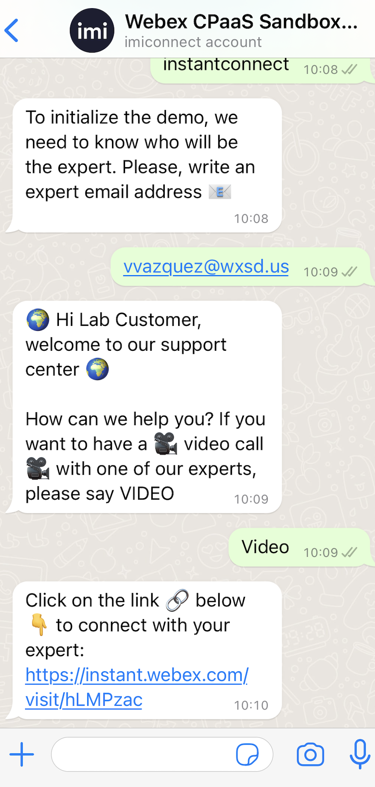
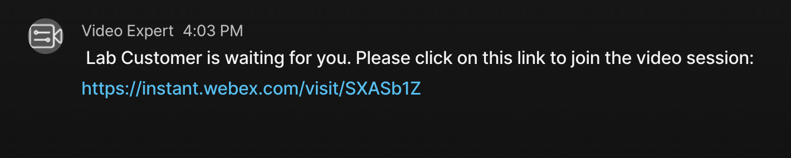
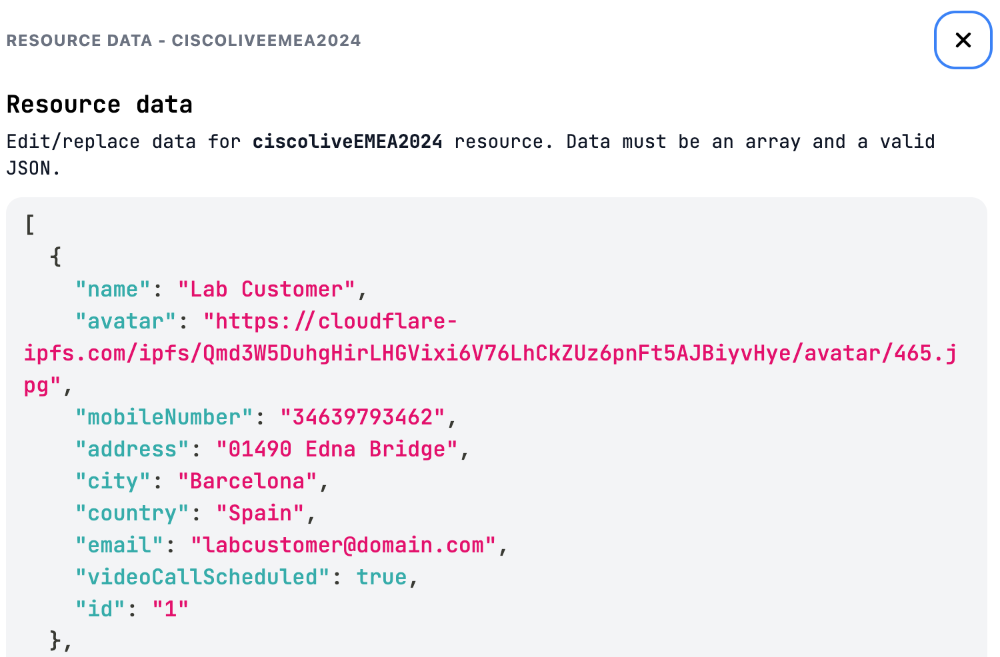

## Testing the Flow

Remember I removed how to know your WA number from 5!
This:
Go to your Webex Connect **Sandbox Home** page.

   Click on the **WhatsApp Message** tab and select the **Receive WhatsApp Message** option.
   
   **Number to message** is your Connect sandbox WhatsApp number. Write it down, or create a new contact in your mobile phone with this number. We will send messages here later.

I remove also:
> **Note:** if this is your first time using Webex Connect, you may want to review some additional info:
> 1. [Hands-On Building Webex Connect Flows lab](https://devnetapps.cisco.com/learning/labs/webex-connect-flows/)
> 1. Cisco Live 2023 Devnet Session DEVNET-1850 recording, [Introducing Webex Connect and CPaaS APIs](https://www.ciscolive.com/on-demand/on-demand-library.html?search=DEVNET-1850#/session/1675722407287001tHws)

---

OLD !!!

To publish your flow:

1. Click on **MAKE LIVE**, and select your WhatsApp application.

1. To trigger it, send the keyword: `instantconnect`

   The customer interaction you should get is shown below::

   ]

1. Check that:

   * Your customer name (`Lab Customer` in the example) is used in the first answer.
   * The Guest meetings link is sent to the customer (refer to the image above).
   * The Expert receives a Webex message from the bot, including the meeting link:

   

   * The mockAPI.io record is updated, with `videoCallScheduled: true`

   

1. Join the meeting as the customer on your mobile device, and as the expert on your desktop device. 

   Try some of the Webex Instant Connect features, such as:

   * Video call control (mute/unmute, turn your video on/off, ..). 

   * Meeting end: guest can leave the meeting at any time, host can leave without ending, or end meeting for all

   * Change the video Layout

   * Share your screen

   * Blur your background

   * Remove background Noise

   * See the list of participants, and invite new guests

   * Chat

   * Integrate with Webex video endpoints, by configuring [Virtual Rounding](https://help.webex.com/en-us/article/6vsdoi/Configure-Virtual-Rounding). And with the possibility of [Controlling remote cameras](https://help.webex.com/en-us/article/nuwutmx/Control-remote-cameras-with-Instant-Connect)

For more information, visit [Webex Instant Connect @ Webex Help Center](https://help.webex.com/en-us/article/sv0h2ab/Webex-Instant-Connect).
