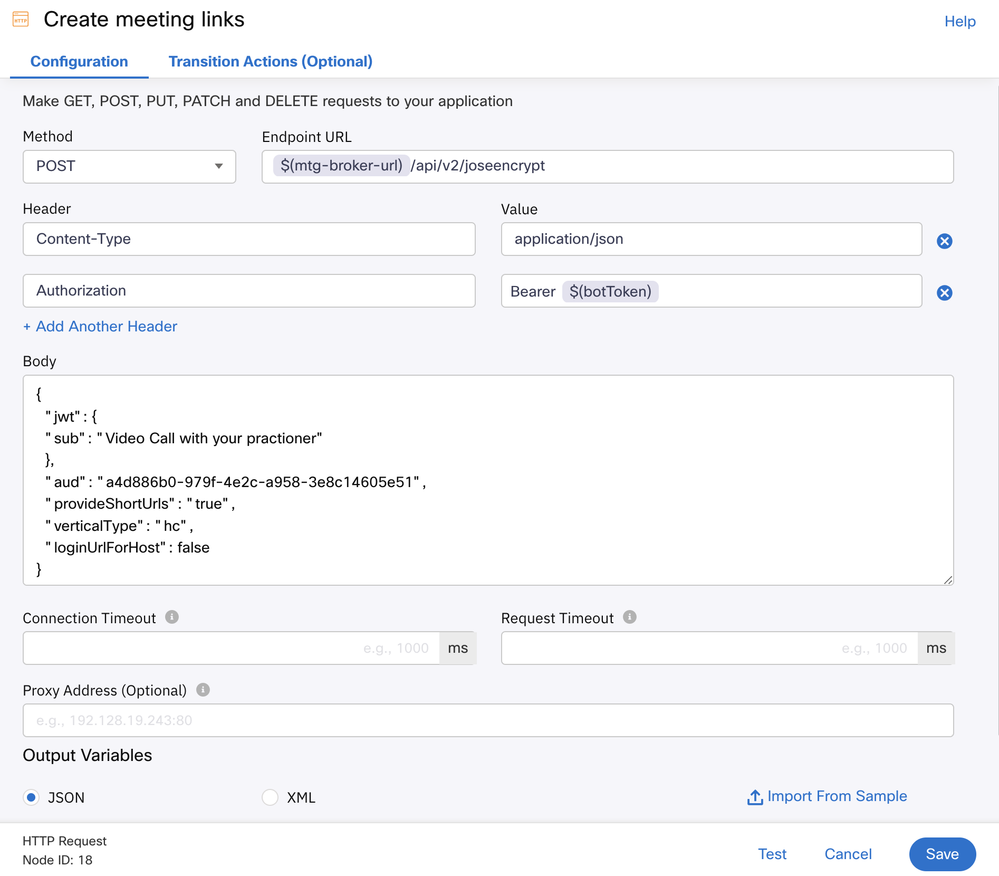
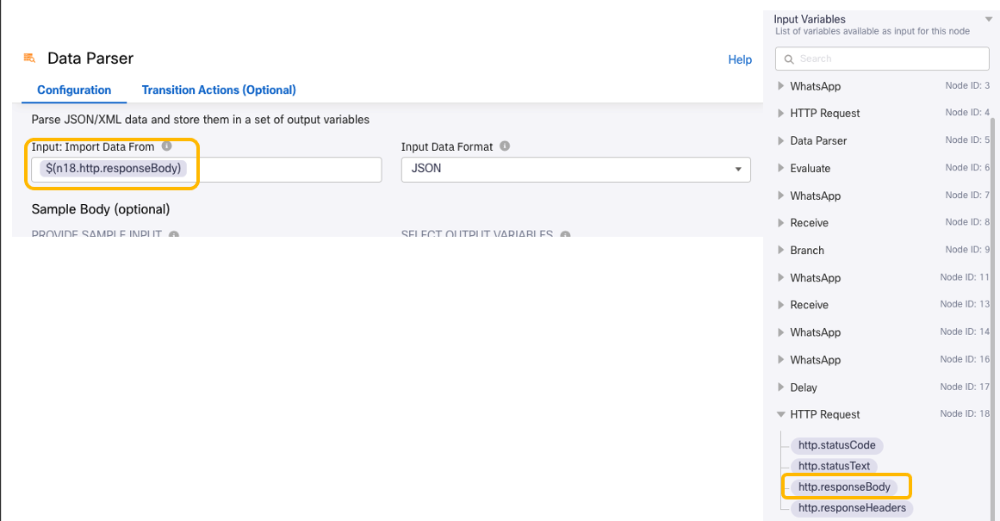
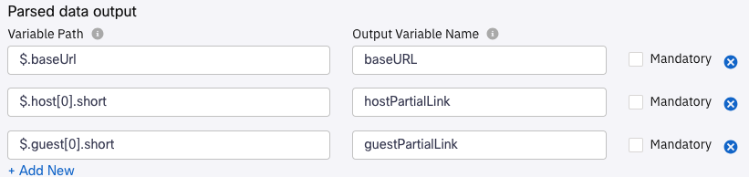

# Create and share Instant Connect Meeting Links

## Create Meeting Links

Similarly to what we did previously in the [Webex Instant Connect API](04-instantconnectapi.md) step earlier, here we will create Webex Instant Connect meeting links.  However, instead of using Postman we will use an **HTTP Request** node. 

1. As we did in [this section](08-connectflow-03.md#get-customer-data) , we will create some Custom Variables
    - Create one named `botToken` and give it the value we noted [here](04-instantconnectapi.md#create-your-bot)
    - Create a second Custom Variable called `mtg-broker-url` with value = `https://mtg-broker-a.wbx2.com`

2. Add a new **HTTP Request** node to the canvas, and connect it to the previous **Delay** node orange dot

- Configure the node as shown below:

    

    Here you have some of the values that you can copy-paste:

    - Endpoint URL = `$(mtg-broker-url)/api/v2/joseencrypt`
    - Body = 

            {
                "jwt": {
                "sub": "Video Call with your practitioner"
                },
                "aud": "a4d886b0-979f-4e2c-a958-3e8c14605e51",
                "provideShortUrls": "true",
                "verticalType": "hc",
                "loginUrlForHost": false
            }
        With the option `verticalType` = `hc` , Instant Connect user interface will be customized automatically for a Healthcare use case.

- Rename the node to 'Create meeting links' and **Save** it

3. Add a **Data Parser** node to the canvas, and connect it to the previous **HTTP Request** node

- To get the value for **Input: Import Data From**, we will do as in this [section](08-connectflow-03.md#get-customer-data), choosing the `http.response.body` variable from the previous **HTTP Request** node `Create Meeting Links` configured in the previous step:

> **Note:** Node numbers may be different.

- For the **Sample Body**, you can use the response body you got in Postman. Remember that you have one example [here](04-instantconnectapi.md#construct-the-meeting-urls).

- Click on **Parse**

- In this case you do not need to **Select** and **IMPORT** all the variables, `$.baseUrl`, `$.host[0].short` and `$.guest[0].short` are enough.

    Set the **OUTPUT VARIABLE NAMES** as shown below:

    

    And **Save** the node

4. Next, we will build variables containing the host and guest URLs. We can use again the embedded capabilities of Webex Connect nodes for this:

- Edit the  **Data Parse** node we just created, and go to the **Transition Actions (Optional)** tab.

- As we did in [this section](09-connectflow-04.md#offer-scheduling-options), Add an Action and create two **Custom Variables**: `guestURL` and `hostURL`.

    As we saw previously, the URL values are created by concatenating the `baseUrl` and the values in the `short` and `guest` keys on node leave.
        
    

   > **Note:** Node numbers may be different.

## Send link to customer

1. Go to the 'Welcome' **WhatsApp** node, select it, copy-paste it and connect it to the previous **Data Parser** node

2. Change the Payload to: `https://qaemailmedia.s3.amazonaws.com/3cd774f7-5b9b-4098-a88c-0b0ed969c80b/hospitallogo_4360154910688899.jpeg``

3. Change the Caption to: `Hi $(customerName), you can join your video appointment in this link: $(guestURL)`

4. Rename the node to 'Offer guest URL to customer' and **Save** it

## Send link to expert

Next we will use the [Webex messaging API](https://developer.webex.com/docs/api/v1/messages/create-a-message) to send a message from your Webex bot to the expert.

1. Let's create some Custom Variables

    - Create one named `WebexAPI`and give it the value `https://webexapis.com/v1``
    - Create a second Custom Variable called `expertEmail`. Flow will be sending the host url to this user a Webex message.

2. Add an **HTTP Request** node to the canvas, and connect it to the previous **WhatsApp** node.

    - Configure the node as shown below:

        

        Here you have some of the values that you can copy-paste:

        - Body = 

                {
                    "toPersonEmail":"$(expertEmail)",
                    "text":"$(customerName) is waiting for you. Please click on this link to join the video session: $(hostURL)"
                }  
    - Rename the node to 'Offer host URL to expert' and **Save** it

[Go to the Next section](./11-connectflow-06.md)

[Go to the Table of Contents](README.md#table-of-contents)

