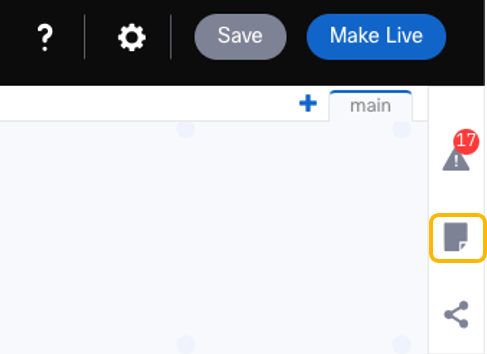
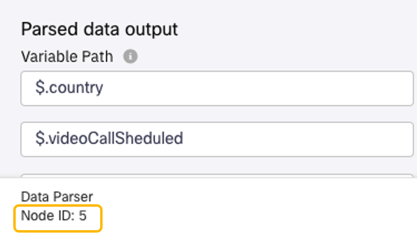
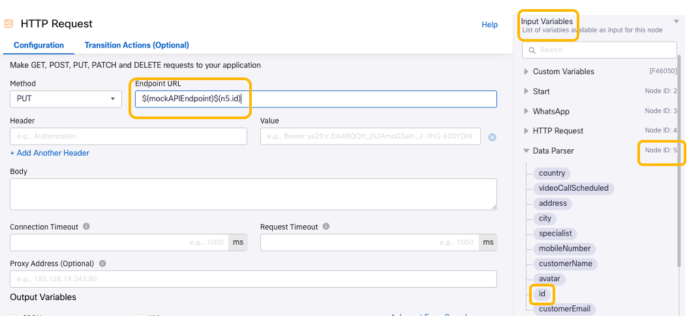

# Update CRM

According to the [mockAPI.io API documentation](https://github.com/mockapi-io/docs/wiki/Quick-start-guide), the way to update a record is:

We need to know the `{userId}` for the record we want to update. We got this value in the response of the http request we did in [this section](08-connectflow-03.md#get-customer-data), let's see how we can use this value at ay time in the flow:

1. Get the 'mockAPI' **Data Parser** node number, there are several ways of doing this:

    - Clicking on **NOTES** icon
    
    

    - You can also double-click on the node, you will see the node number at the bottom left
    
    

    In this example, 'mockAPI' **Data Parser** node number is 5 (n5).

2. Add a new **HTTP Request** node, add it to the canvas, and connect it to the previous **HTTP Request** node.

- Choose `PUT` as the **Method**
- Go to **Endpoint URl**, select `mockAPIEndpoint`under **Custom Variables** in **Input Variables** section
- In the same **Input Variables** section, type '/', go to the `mockAPI`**Data Parser** node (node 5 in this example), and select `id`:

- Add `Content-Type`as **Header**, with **Value** `application/json`
- And configure the Body =

        {
            "videoCallScheduled": true,
            "specialist": "$(specialist)"
        }

- Rename the node to 'Update CRM', and **Save** it

Now we are ready to [test our flow](./12-testingflow.md) !

[Go to the Table of Contents](README.md#table-of-contents)

