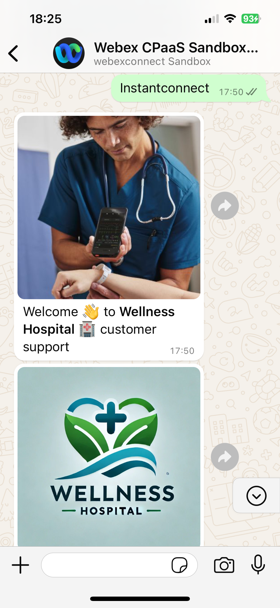
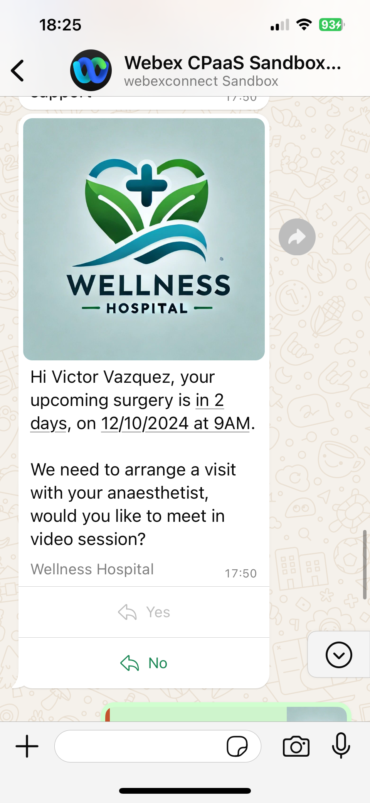

# Testing the Flow

## Publish the Flow

Click on **MAKE LIVE**, and select your WhatsApp application (typically 'SandboxTest')

## How to know your Tenant WhatsApp number

1. Go to your Webex Connect **Sandbox Home** page.

2. Click on the **WhatsApp Message** tab and select the **Receive WhatsApp Message** option.
   
   **Number to message** is your Connect sandbox WhatsApp number. Write it down, or create a new contact in your mobile phone with this number.

## Trigger the flow

Send a WhatsApp message with the text `instantconnect` to your Tenant WhatsApp number. This is the experience that you should get:

## Checking the Flow

As you through the WhatsApp conversation, you should see:

- The customer name read from mockAPI used in the Surgery reminder WhatsApp message to the customer, and in the Webex message to the expert

- The date properly set to two days in the future

- CRM (mockAPI) updated with `videoCallScheduled`= true and the name of the specialist chosen in 
the WhatsApp list

- The guest Instant Connect meeting link is sent to the customer on WhatsApp

- The host Instant Connect meeting link is sent to the expert on Webex

## Join the Instant Connect meeting

1. Join the meeting as the customer on your mobile device, and as the expert on your desktop device. 

   Try some of the Webex Instant Connect features, such as:

    - Video call control (mute/unmute, turn your video on/off, ..). 

    - Meeting end: guest can leave the meeting at any time, host can leave without ending, or end meeting for all

    - Change the video Layout

    - Share your screen

    - Blur your background

    - Remove background Noise

    - See the list of participants, and invite new guests 

    - Chat

For more information, visit [Webex Instant Connect @ Webex Help Center](https://help.webex.com/en-us/article/sv0h2ab/Webex-Instant-Connect).

[Go to the Table of Contents](README.md#table-of-contents)
