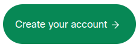
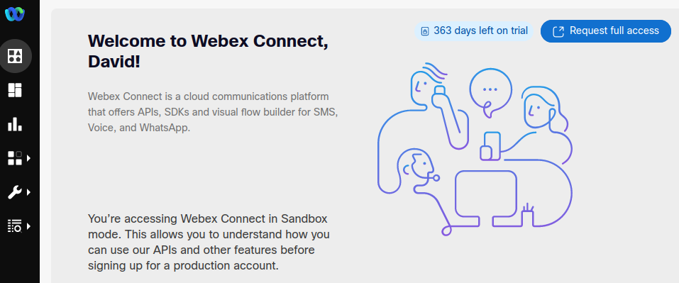
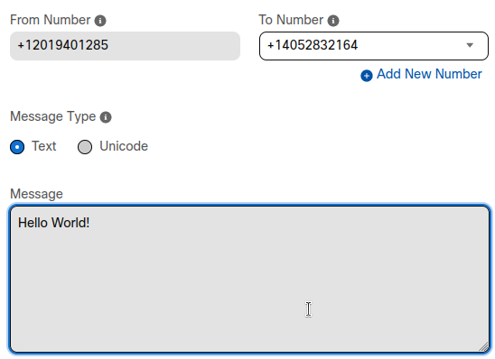
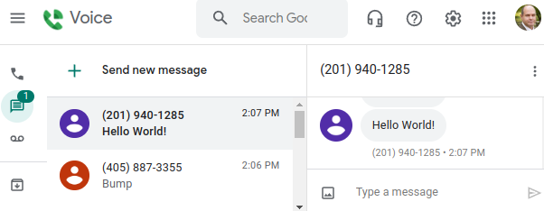

# Developer Sandbox Sign-Up

To start exploring the Flow Editor, you'll need a free Webex Connect developer account.  To complete the sign-up process and participate in all the activities for this lab, you'll need:

* A business email address where you can receive an activation/confirmation email.

* A mobile phone number where you can send/receive SMS messages

  > **Note:** you must provide a **_business_** email account - free/consumer email like GMail won't work.

Let's get started:

1. Browse to the [Developer Sandbox page](https://imimobile.com/products/webex-connect/sandbox) and click the **Create your account** buton:

   

1. Complete the form (including your business email address), then check your email inbox for the one-time verification code and enter it.

1. Next, enter your mobile phone number, wait for the confirmation SMS and verify again.

1. Navigate back to the Developer Sandbox sign-up page, and click the **Access the developer sandbox** button (scroll way down to the bottom of the page), or just jump directly: [Developer Sandbox](https://sandbox.imiconnect.io/cpaas-dashboard/sms)

    You should be in!

    

## Sending a Test Message

Upon first arriving at the Sandbox home page, we see a form allowing us to send a SMS message.  This message will be sent via the Webex Connect REST API - you can see examples of how to use this API from code on the right-hand side using Curl/Java/Node.js.

Let's try it out:

1. Note that the **From Number** is already populated with a phone number - this is from a pool of numbers held by Webex Connect and automatically assigned to your Sandbox.

   **To Number** is also already populated, with the phone number you provided during sign-up.

   The only thing you need to enter is text for your **Test Message**:

   

1. Click on **Send Message** to fire it off.

   You should receive the test message on your mobile phone shortly!

   

