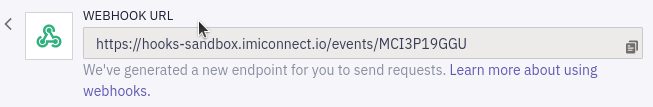

# Flow Editor Tour

Our end goal for this lab will be to create a Flow that can notify a patient of an upcoming appoint, allowing them to cancel/reschedule via SMS as needed.


Let's open up the Flow Editor and take a quick tour of its features and tools.  

## Service Dashboard

At the highest level, Webex Connect let's you organize flows by projects called **Services**.  Typically these would be created for each of your application customer interaction/journeys.

For now let's just access the auto-created default service:

1. From the left-side navigation bar, click on the **Services** icon:

   

1. Choose the default "My First Service"

   This should take you to the service Dashboard, which provides an overview of your service's activity and configuration, including analytics on recent traffic activity, access to the REST API docs/tools, and the...Flow Editor!

   

## Creating a Flow

1. Select the **Flows** tab, then go ahead and click **Create Flow**.

   Give the flow a name.  
   
   For this lab, let's create our flow using the "Appointment" template:

   

   This will open up the Flow Editor, which will automatically open the **Configure Webhook** property page.

1. Our Flow will be triggered by an incoming [webhook](https://en.wikipedia.org/wiki/Webhook) - i.e. an HTTP POST with some JSON-formatted initial data.  You can view your Flow's auto-generated webhook URL here:

   

   Webhooks are a very common way for applications to send events + data to each other; for example, a health clinic's patient system could send a batch of webhooks to this Flow each day based on a query of all patients booked for appointments the next day.

   Go ahead and give your webhook a name - can be anything, perhaps "Appointment Webhook"

1. A trigger webhook will of course need to deliver some data _from_ the triggering application _to_ our Flow.  

    Define the expected JSON contents (just the keys) by pasting this sample webhook payload into the **PROVIDE SAMPLE INPUT** area:

   ```json
   {
       "Phone": "",
       "Name": "",
       "Appt": ""
   }
   ```

   Click **PARSE**.

   If the data was parsed correctly, it should look like this:

   

1. That's all the trigger configuration needed for now...go ahead and click **Save**, which should bring you to the Flow Editor main screen.

   You can see that a fairly complete Flow has been automatically created, including event, data and logic nodes and logical interconnections needed to orchestrate them.  The gist of what this Flow does and how it works can be gleaned with just a quick inspection:

   

Feel free to play around in the Flow Editor for bit: check out the Utilities/Channels/Integrations tabs, try out the bottom toolbar options, peek into some of the nodes (double-click), etc.

>  **Note:** If you make a change (e.g. dragging-dropping a new node onto the canvas), you can't manage to undo (i.e. with **Ctrl+Z**), you can always delete the flow and recreate it from the template.


  
