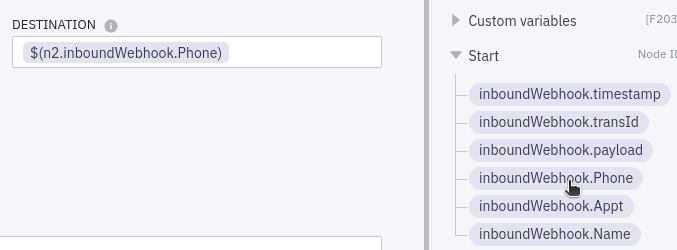
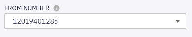
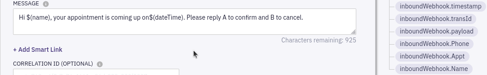

# Sending the Initial SMS

We've already configured the Flow's triggering webhook (we'll learn how to test it a bit later), the next step in the sequence will be to send the initial notification SMS to the patient based on the webhook's data variables:

1. Double-click on the **Send SMS** node to open it and view the configuration page.

1. Delete the place-holder contents of the **Destination** field.

   Replace it by opening the **Start** collection on the right side and clicking `inboundWebhook.Phone`:

   

1. In the **FROM NUMBER** field, select the (default, only) **Sender ID**:

   

   This is a phone number associated with your Webex Connect Service - i.e. the 'Caller ID' the patient will see for the SMS.

1. In the **MESSAGE** field, delete `$(name)` and `$(dateTime)` from the message text, and replace with `inboundWebhook.Name` and `inboundWebhook.Appt`:

   

1. You can now **Save** the configuration.

## Receiving the Patient Response

Once the initial reminder SMS has been sent to the patient, the Flow will need to await the patient's response (if any!):

1. Open the **Receive** node configuration.

1. In the **Receive SMS** section, select the inbound **NUMBER** where we are expecting the patient's response to arrive (this would be the same number the initial SMS was sent from.

   Choose **`*`** for the **KEYWORD**.

   Replace the **FROM NUMBER** with `inboundWebhook.Phone` (under the **Start** variables) - i.e. the patient's phone number.

   

   > **Note:** The **MAXTIMEOUT** value of `600` means that the flow will wait a maximum of 600 seconds (10 minutes) for the patient's reply.

1. Go ahead and **Save**.
