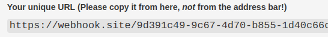
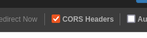
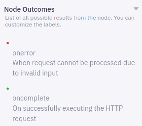
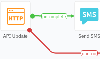
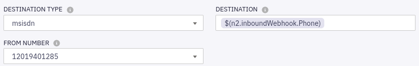
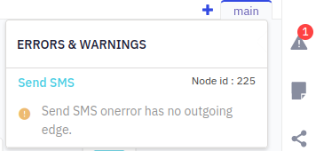

# Checking the Response

Sending the initial response will have a number of results:

* The user replies with 'A' to keep the appointment.
* The user replies with 'B' to cancel the appointment.
* The user replies with something unexpected.
* The user never replies.

The **Branch** node can make `if/then/else` decisions as to which branch of the Flow to follow next:

1. Open the "Check User Response" branch node config.

1. We don't actually need to configure anything here (the template provided the current values), but by inspecting the **Confirm** and **Cancel** conditions, we can see that the node is checking if the received message content output variable from the previous receive node (`$(n11.receive.message)`) "Equals" `A` or `B`.

   

   A default "None of the Above" condition is also there too.

## Reporting Progress

As this Flow could actually take a number of minutes to reach it's final end point, it might be nice if we could monitor it's progress.

This is possible by using the **HTTP** node type to send an _outbound_ message to an external service - here a handy, free hook bin service: [Webhook.site](https://webhook.site/)

In a real Flow, the external service would be a reporting, analytics or dashboard application that would receive the notification + data, then update it's state tracking on the appointment notification request.  However, for our purposes we'll just use the hook bin to accept the message, so we can inspect the HTTP/JSON contents of the outbound webhook:

1. Open a new browser tab and navigate to: [Webhook.site](https://webhook.site/) 

   (Feel free to use another hook/request bin.)

   It should display an auto-generated unique URL where webhooks can be directed:

   
   
   Copy this to your clipboard, and/or keep this tab open.

   > **Important:** You must also select the option to enable [CORS](https://en.wikipedia.org/wiki/Cross-origin_resource_sharing):

   

1. In the Flow Editor, open the top-most **HTTP** node (the one on the "Confirm" branch.)

1. Change the **METHOD** to `POST`.

1. Paste your hook bin's unique URL into the **ENDPOINT URL** field.

1. For the **BODY** we'll just relay all the data from the original triggering webhook, **_PLUS_** a `Status: Confirmed` field indicating how the interaction with the patient is proceeding:

   ```json
   {
      "Phone": "$(n2.inboundWebhook.Phone)",
      "Name": "$(n2.inboundWebhook.Name)",
      "Appt": "$(n2.inboundWebhook.Appt)",
      "Status": "Confirmed"
   }
   ```

   Notice: we're getting the run-time data values from the **Start** variables list on the right-hand side.

   Go ahead and **Save** this node.

1. Open the **Node Outcomes** group in the lower-right:

   

   Notice that an **HTTP** node type has two defined outcomes: `onerror` and `oncomplete`.  This results in corresponding branches in the Flow Editor that will need to be handled (already in place from the template):

   

1. **Repeat** the steps above for the **HTTP** node on the `Cancel` branch, but this time sending `Status: Cancelled`:

   ```json
   {
      "Phone": "$(n2.inboundWebhook.Phone)",
      "Name": "$(n2.inboundWebhook.Name)",
      "Appt": "$(n2.inboundWebhook.Appt)",
      "Status": "Cancelled"
   }
   ```

## Final Configurations

The five remaining nodes we haven't configured yet are all **SMS** nodes:

.png)

 Configure all of these with the same **DESTINATION** and **FROM NUMBER** values as the initial **SMS** node:



## Making Live

The Flow is complete, and should now be ready to publish!

1. Since we're in dev/test mode, click on the **Setting** gear icon in the upper right.

   Under **General** / **Advanced settings**, enable **Descriptive logs**.

   This will give us detailed information about the inputs, outputs and any errors for each Flow node, which will help greatly with any needed troubleshooting!

   > **Note:** Once your Flow is complete, tested and stable you will likely want to disable **Descrive logs** to avoid having any sensitive enterprise or customer data written to the logs.

1. From the Flow Editor overview, click on **Save** in the top-right corner:

   

    During the save process, the system checks that the flow is valid and correctly configured.  If there is a problem, you may see an error/warning message in the top-right:

    

    Clicking on the error will select the offending node, so you can correct its configuration and re-save.

1. Finally, click **Make Live**:

   

   Entering a comment is optional, but can be useful e.g. for versioning.

   > **Note:** publishing can take up to two minutes before the Flow is fully live externally.
