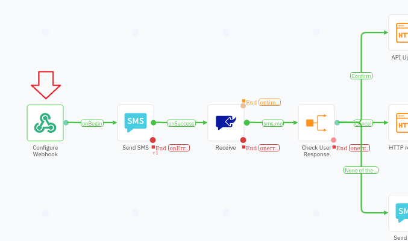
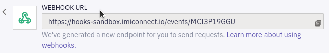
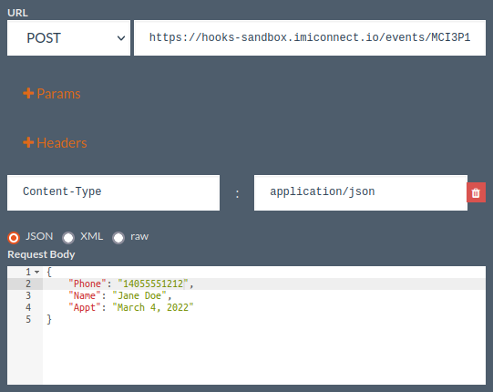
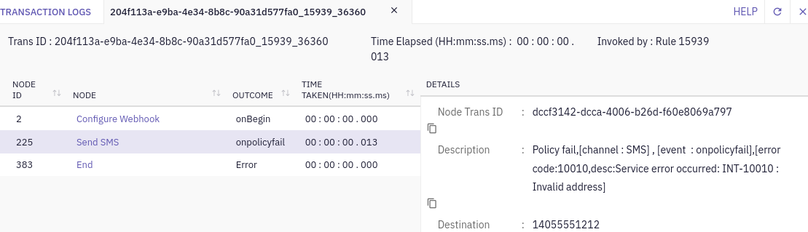

# Testing the Flow

With the Flow live and ready to interact with our enterprise systems and patients/customers, it's time to give it test run!

If you'll recall, the first thing we did after creating the flow was to configure the triggering inbound **Webhook**:



Since we don't have an actual enteprise back-end system programmed to send a real webhook, we need a way to send the webhook message ourselves...for this we will use another free online test tool: [ApiRequest.io](https://www.apirequest.io/)

> **Note:** You can also use the [Postman](https://www.postman.com/) desktop client, [Curl](https://curl.se/) from the terminal, or almost any other HTTP tool to make the webhook HTTP `POST`.

Let's configure and send the HTTP `POST` request needed to trigger our Flow to start:

1. Open another browser tab and navigate to [ApiRequest.io](https://www.apirequest.io/)

1. Select `POST` from the method dropdown.

1. In the URL field, paste in your triggering webook's URL.

   You can retrieve this via the Flow Editor by double-clicking the trigger **Webhook** node and grabbing the **WEBHOOK URL**:

   

1. Click **+ Headers** and add a `Content-Type`: `application/json` header

1. For the **Request Body**, copy the sample input JSON **BODY** from your trigger **Webhook** node and paste, inserting some test data (use your mobile number for `Phone`, being sure to include the country code but not a "**`+`**", e.g "`1`" for the US):

   ```json
   {
       "Phone": "14055551212",
       "Name": "Jane Doe",
       "Appt": "March 4, 2022"
   }
   ```

1. Now you can click **Send One** to fire off the webhook:

   

## Verifying and Troubleshooting

If all went well, a number of things should happen:

1. You should receive an appointment reminder SMS on your mobile phone.

1. Replying with "**`A`**" or "**`B`**" should result in the appropriate acknowledgement SMS message.

1. After the patient reply step, checking your hook bin web page you should see an HTTP `POST` message has arrived, containing the JSON "progress" message configured in the Flow's **HTTP** node.

1. If after sending the webhook something unexpected happens (including nothing!), you can click on the **Debug** "bug" icon to examine the logs and drill into specific node operations for errors and clues:

   


