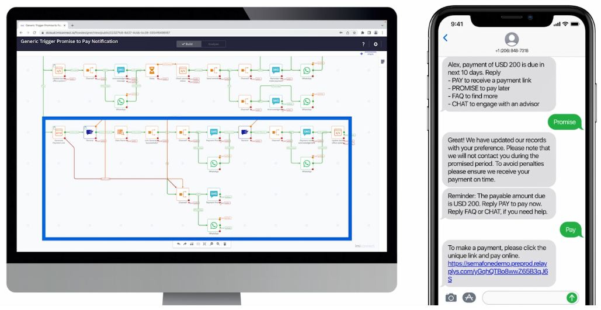

# Going Further

Congratulations on completing the lab and publishing your first live Webex Connect Flow!

We have _absolutely_ only scratched the surface of what's possible for developers with this platform, even just with the Flow Editor :)  With all the various node types and capabilities - including the **Evaluate** node where you can execute native JavaScript in your Flow's context - multiple micro-service like Flows, with multiple sub-modules, interacting with multiple enterprise back-ends and communications channels can be really intricate, fascinating...and powerful!

 There's lots more to explore:

* Try out some of the additional Flow templates
* Experiment with some of the many Flow nodes under **Utilities**, **Channels**, and **Integrations**
* Bring your developer coding chops to bear by making some direct REST API requests (see the [API Reference](https://developers.imiconnect.io/reference/apioverview)).
* Request [Full Access](https://imimobile.com/products/webex-connect/sandbox/request-upgrade) for your Webex Connect account to unlock the full suite of 3rd party communications channels and other enterprise capabilities.
* [Book a Webex Connect](https://imimobile.com/contact) demo to get a 1-on-1 demo and Q&A session with the sales & support team.

## Getting Help

If you have questions about the platform, Flow Editor, or APIs, contact [Webex Connect Support](https://developers.imiconnect.io/docs/imiconnect-support) for assistance.
